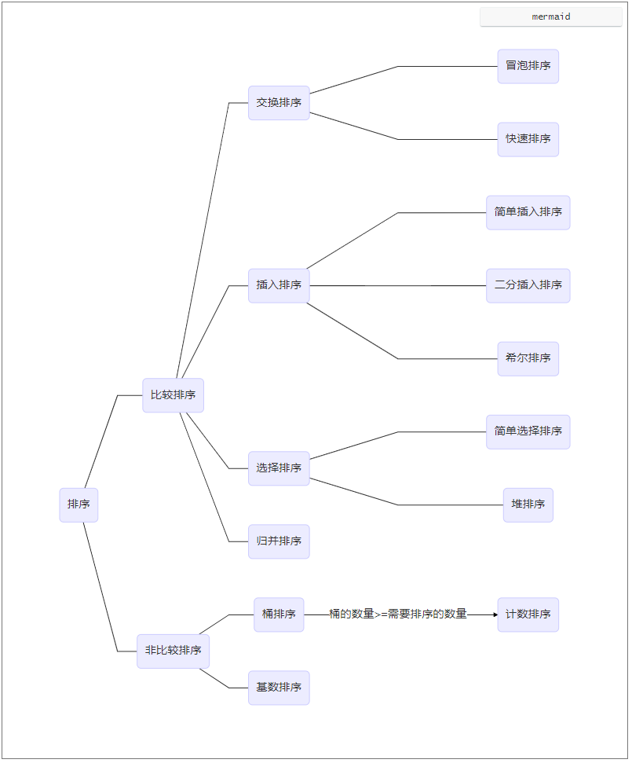
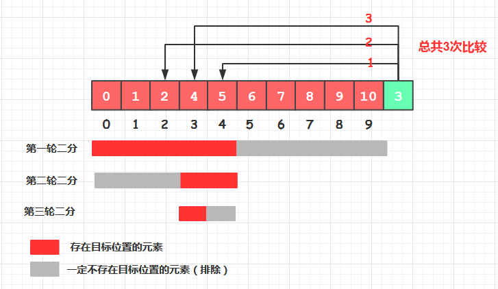

# 排序算法

## 排序算法分类图

## 算法比较表

| 算法名称     | 最好/最差/平均时间复杂度       | 空间复杂度 | 稳定性 |
| ------------ | ------------------------------ | ---------- | ------ |
| 冒泡排序     | O(N) / O(N^2) / O(N^2)         | O(1) | 稳定 |
| 简单选择排序 | O(N^2) / O(N^2) / O(N^2)       | O(1) | 不稳定 |
| 简单插入排序 | O(N) / O(N^2) / O(N^2)         | O(1) | 稳定 |
| 二分插入排序 | O(N) / O(NlogN) / O(NlogN) | O(1) | 稳定 |
| 希尔排序     | O(N) / O(N^2) / O(N^1.3)   | O(1) | 不稳定 |
| 堆排序       | O(NlogN) / O(NlogN) / O(NlogN) | O(1) | 不稳定 |
| 快速排序     | O(N) / O(N^2) / O(NlogN)       | O(NlogN) | 不稳定 |
| 归并排序     | O(NlogN) / O(NlogN) / O(NlogN) | O(N) | 稳定 |
|  |  |  |  |
| 基数排序     | O(NK) / O(NK) / O(NK) |            | 稳定 |
| 计数排序     | O(N+K) / O(N+K) /O(N+K)      |            | 稳定 |
| 桶排序       | O(N) / O(N^2) / O(N+K)  |            | 稳定 |

:::tip 解释

基数排序中的K:待排序数组中最大值的位数

计数/桶排序中的K:待排序数组中的最大值

:::

:::tip  相关概念

稳定：如果a原本在b前面，而a=b，排序之后a仍然在b的前面。

不稳定：如果a原本在b的前面，而a=b，排序之后 a 可能会出现在 b 的后面。

:::

## 三四句话算法讲解

### 冒泡排序

教科书中一定会提到的算法，采用双重循环比较的方式，每次比较将较大的数置后，每次遍历将选出一个最大的数

由于每次遍历都会比较所有需要比较的数，且需要比较N次，故平均时间复杂度为O(N^2)

由于只是待排序中的数进行比较并不需要额外的空间，故空间复杂度为O(1)

**动图展示**

### 简单选择排序

采用双重循环比较的方法，每次循环比较选出一个最小值与头部交换

由于每次遍历都会比较所有需要比较的数，且需要比较N次，故平均时间复杂度为O(N^2)

由于只是待排序中的数进行比较并不需要额外的空间，故空间复杂度为O(1)

不稳定反例数组：5 4 5 2

**动图展示**

### 简单插入排序  

假设当前排序数之前的数组有序，在之前的有序数组中**顺序**找出当前排序数应该插入的位置并插入

由于每次遍历都有可能比较所有有序数组中的数，且需要比较N个数，故平均时间复杂度为O(N^2)

由于只是待排序中的数进行比较并不需要额外的空间，故空间复杂度为O(1)

**动图展示**

### 二分插入排序  

假设当前排序数之前的数组有序，在之前的有序数组中**使用二分算法**找出当前排序树应该插入的位置并插入

二分算法查找到目标的时间复杂度为O(logN)，一共需要查找N次，故平均时间复杂度为O(NlogN)

由于只是待排序中的数进行比较并不需要额外的空间，故空间复杂度为O(1)

**图片展示**

### 归并排序  

使用分治的思想，将数组等分为两个数组，将两个数组进行归并排序，将两个有序数组合并

数组每次二等分，直到数组数量为1，经历了logN次，合并一共需要对N个数排序，故时间复杂度为O(NlogN)

合并时需要申请空间进行数组合并，故空间复杂度为O(N)

**动图展示**

### 桶排序  

将所有待排序数根据特定的函数公式分别放入多个桶中，对每个桶进行排序

注意：该算法的函数公式是否可以将所有数尽可能的平均分配到桶中，以及对单个桶采用的排序算法，都决定了桶排序算法总体的优劣

### 计数排序  

桶排序的极致

1. 找出最大值，初始化大小为最大值的数组作为桶
2. 将每个值填入对应编号的桶中，而后顺序遍历所有桶

只需要遍历两遍待排序数组加一遍桶，故时间复杂度为O(N)

适用范围：正整数

**动图展示**

## N句话算法讲解

### 希尔排序  

又称为缩小增量排序，取整数inc作为间隔将全部元素分为inc个子序列，对每一份进行简单插入排序，而后缩小inc，直到inc=1

**比较普遍的inc取数公式**：

- 初始化  inc=arr.length
- inc=inc/3+1

由于只是待排序中的数进行比较并不需要额外的空间，故空间复杂度为O(1)

不稳定反例：1 5 6 3 4 5

**动图展示**

### 堆排序  

堆：完全二叉树

大根堆：父节点 > 叶子节点

小根堆：父节点 < 叶子节点

排序过程

1. 将待排序数组当成完全二叉树：父节点>叶子节点，从最后一个非叶子节点进行堆调整
2. 将调整好的二叉树的根节点与最后一个节点进行交换，继续调整堆并重复该步骤

N个数形成的堆的高度为logN，需要调整N个数，故时间复杂度为O(NlogN)

由于只是待排序中的数进行比较并不需要额外的空间，故空间复杂度为O(1)

不稳定反例：9 8 7 6 5 6

**动图展示**

### 快速排序  

使用分治的思想

1. 选择最左侧值为key
2. 先从右边遍历找到一个小于key的值right，再从左边遍历找到一个大于key的值left
3. 交换left、right
4. 重复2、3步骤直到左右指针重叠，交换key值和left的值
5. 对left左右两边的数组分别在进行上述步骤

注意点：选左侧值为key则要先从右侧开始找，反之要先从左侧开始找

分治的思想将数组分为两份，平均需要分logN次，一遍需要遍历N个数，故时间复杂度为O(NlogN)

不稳定反例：5 7 7 1 1

**动图展示**

### 基数排序  

1. 找出最大值MAX，最大值的位数即为排序的次数MAXRADIX
2. 准备10个桶，分别装入值为0-9的数
3. 对所有数的某一位进行入桶，出桶
4. 从低位到高位执行3步骤，执行MAXRADIX次

每次对所有数进行遍历，遍历次数为K次，故时间复杂度为O(NK)次

**动图展示**

## Java代码示例

[https://github.com/VAS-QZ/keep-doing-exercises/blob/master/src/main/java/Sort.java](https://github.com/VAS-QZ/keep-doing-exercises/blob/master/src/main/java/Sort.java)

## 参考博客

[https://www.cnblogs.com/onepixel/articles/7674659.html](https://www.cnblogs.com/onepixel/articles/7674659.html)

所用到的图来自于互联网，图侵删