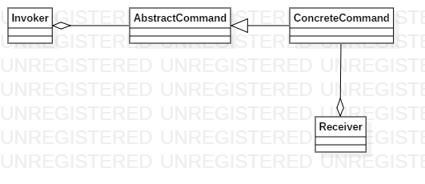
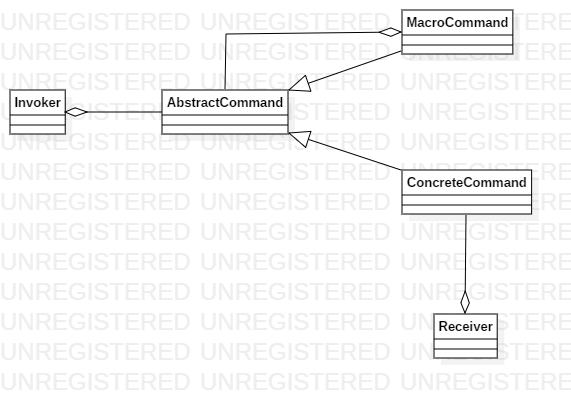

# 命令模式

命令模式将一个请求封装成一个对象，从而让我们可用不同的请求对客户进行参数化。命令模式是一种行为型设计模式。

## 场景假设及代码实现

顾客到饭店吃饭，点了一条鱼，厨师做鱼

那么在这个场景中，包涵这么几个产生行为的对象：顾客、厨师。于是乎代码如下

```java
public class Cook {

    public void cookFish() {
        System.out.println("fish is ok");
    }

}

public class Consumer {

    public void orderFish(Cook cook) {
        cook.cookFish();
    }

}
```

乍一看貌似挺对的，顾客点鱼，厨师做鱼。但是顾客在点鱼时需要知道是哪个厨师吗？很明显是不需要的，顾客只需要知道我要点什么菜就好了，至于是怎么做出来的，谁做出来的，完全不关心。霸气一点的说法，顾客掏钱吃饭就是掏钱下命令，顾客花了点鱼的钱下了吃鱼的命令。于是乎我们引入了命令类，顾客直接下命令就好了，注意，我们在引入命令类的时候注意符合*依赖倒置原则*

```java
public abstract class AbstractCommand {
    public abstract void execute();
}

public class FishCommand extends AbstractCommand{

    private Cook cook;

    @Override
    public void execute() {
        this.cook.cookFish();
    }
}

public class Consumer {

    public void orderFish() {
        AbstractCommand command = new FishCommand();
        command.execute();
    }

}
```

上述代码解耦了顾客和厨师的直接依赖关系，顾客想吃鱼就直接下达吃鱼的命令就好了，不需要知道是哪位厨师做出来的。但是好像还是有哪里不太对，顾客可以直接对厨师下命令吗？好像不可以，顾客应该是对服务员下命令，由服务员来向厨师转达命令。于是我们又引入了服务员类

```java
public class Waiter {
    @Setter
    private AbstractCommand command;

    Waiter() {
        System.out.println("请您点菜");
    }

    public void call() {
        command.execute();
    }

}

public class Consumer {

    public void orderFish() {
        Waiter waiter = new Waiter();
        waiter.setCommand(new FishCommand());
        waiter.call();
    }

}
```

## 小结

在命令模式中，存在四种角色

- Invoker：调用者
- AbstractCommand：抽象命令类
- ConcreteCommand：实际命令类
- Receiver：接收类

在上述代码中，Waiter作为调用者发送命令，FishCommand作为实际命令类继承与抽象命令类，而Cook作为命令的实际执行者执行命令。经过了两次重构，我们成功的将命令的发出者与执行者解耦，其类图如下



## 场景变更及代码实现

大家到饭店肯定都不会只点一个菜，服务员也不会每点一个菜就去给厨师下达一个命令然后再回来继续等顾客点菜，正常的情况下一定是顾客一次性点多个菜，服务员一次性下达做多个菜的命令

这个时候我们就需要有一个可以涵盖多个命令的命令，也就是宏命令来完成我们的需求

```java
public class MacroCommand extends AbstractCommand {

    List<AbstractCommand> commands = new ArrayList<>();

    @Override
    public void execute() {
        for (AbstractCommand command : commands) {
            command.execute();
        }
    }
    
    public void addCommand(AbstractCommand command) {
        this.commands.add(command);
    }

}
```

大家看这段代码有没有一点眼熟，没错，宏命令模式就是命令模式与组合模式的结合，确切的来说是命令模式和安全组合模式的组合，因为只有宏命令类需要添加命令的方法。

其类图如下



命令模式还可以和备忘录模式结合来完成撤销命令以及重复命令的操作，本例子过于简单就不强行更改了，有兴趣的请查看[这里](https://blog.csdn.net/xiheandroid/article/details/18350509)