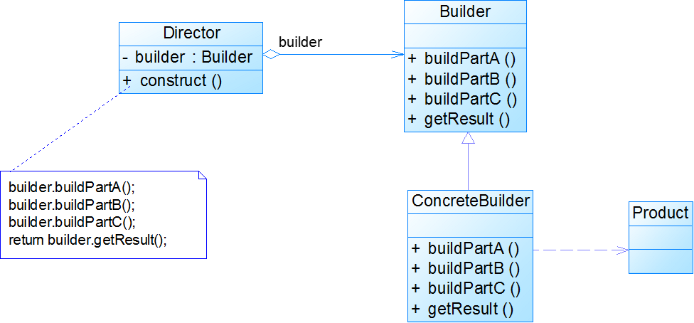

# 建造者模式

建造者模式是一种创建型设计模式，又名生成器模式。它可以将复杂对象的建造过程抽象出来，使这个抽象过程的不同实现方法可以构造出不同表现的对象。

## 根据需求重构代码

首先我们来实现一个需求：客户想看一个天使

那么我们的初始代码可能是这样的

```java
public class Show {

    public void showRolesLook() {
        Angle angle = new Angle();
        angle.buildBody();
        angle.buildFace();
        angle.buildWing();
        angle.show();
    }

}

@Setter
@Getter
public class Angle {
    private String body;
    private String face;
    private String wing;
    private String skin;
    
    public void buildBody() {
        setBody("pretty");
    }

    public void buildFace() {
        setFace("slim");
    }

    public void buildWing() {
        setWing("white");
    }

    public void buildSkin() {
        setSkin("full");
    }

    public void show() {
        System.out.println("This is a beauty with " +
                this.face + " face and " +
                this.body + " body and " +
                this.skin + " skin and " +
                this.wing + " wing");
    }
}
```

那么我们来看一看上述代码，首先它完成了我们的需求吗？貌似完成了，但是完成的好吗？貌似不是很好，因为这两个类都违反了单一职责原则

- 展示类不应该负责对天使类的构建

- 天使类作为一个POJO类，不应该负责身体各部分的具体建造

好的，那我们针对上述两个坏味道进行代码重构，重构后的代码如下

```java
public class Show {

    public void showRolesLook() {
        Angle angle = getAngle();
        angle.show();
    }

    private Angle getAngle() {
        AbstractBuilder angleBuilder = new AngleBuilder();
        return angleBuilder.construct();
    }

}

@Setter
@Getter
public class Angle {
    private String body;
    private String face;
    private String wing;
    private String skin;

    public void show() {
        System.out.println("This is a beauty with " +
                this.face + " face and " +
                this.body + " body and " +
                this.skin + " skin and " +
                this.wing + " wing");
    }
}

public abstract class AbstractBuilder {
    @Getter
    protected Angle angle = new Angle();

    public abstract void buildBody();

    public abstract void buildFace();

    public abstract void buildWing();

    public abstract void buildSkin();

    public Angle construct() {
        buildBody();
        buildFace();
        buildWing();
        buildSkin();
        return getAngle();
    }
}

public class AngleBuilder extends AbstractBuilder{

    @Override
    public void buildBody() {
        angle.setBody("pretty");
    }

    @Override
    public void buildFace() {
        angle.setFace("slim");
    }

    @Override
    public void buildWing() {
        angle.setWing("white");
    }

    @Override
    public void buildSkin() {
        angle.setSkin("full");
    }

}
```

如上述代码，我们将天使类的构建部分全都移动到AngleBuilder中，现在至少Show和Angle类都已经符合单一职责原则了。那么我们新增加的两个builder类有什么问题呢？乍一看貌似没什么问题，及符合单一职责原则，也符合依赖倒置原则。ok，那我们来对需求进行一些更改

新需求：客户希望看到天使有翅膀和没有翅膀的区别

从新需求我们可以得知，我们需要新创建一个没有翅膀的天使，于是乎我们就需要在AbstractBuilder中新增加一个如下方法

```java
    public Angle constructWithoutWing() {
        buildBody();
        buildFace();
        buildWing();
        buildSkin();
        return getAngle();
    }
```

那么这里我们就已经违反了开闭原则，咋办呢？我们新引入一个指挥者来指挥建造者进行建造，代码如下

```java
public class Director {

    public Angle construct(AbstractBuilder builder) {
        builder.buildBody();
        builder.buildFace();
        builder.buildWing();
        builder.buildSkin();
        return builder.getAngle();
    }

}
//将抽象构造者中的构造天使方法移到Director中
public abstract class AbstractBuilder {
    @Getter
    protected Angle angle = new Angle();

    public abstract void buildBody();

    public abstract void buildFace();

    public abstract void buildWing();

    public abstract void buildSkin();

}
```

这时，如果我们需要新创造一个没有翅膀的天使就只需要引入一个Director，并且在其构建天使方法中不调用buildWing方法就可以了

## 总结重构结果

接下来我们对这个重构的结果进行总结。

在刚刚重构的过程中，我们首先发现Show和Angle类中有不是他们职责的代码，于是我们这些代码抽出形成建造者类；而后在用户更改需求时，我们将构造天使方法抽出形成指挥者类。那么在这其中出现了一下5个角色

- 产品类：Angle
- 建造者类
  - 抽象建造者类：AbstractBuilder
  - 具体建造者类：AngleBuilder
- 指挥者类：Director
- ~~客户端类：Show（一般不计）~~

他们之间的关系如下



## Q&A

- 建造者模式与工厂模式的区别，为什么不用工厂模式来创建对象？

  建造者模式关注的是建造的细节，如果产品类的创建过于复杂，那么就需要使用建造者模式。工厂模式关注的是产品的种类，如果产品种类繁杂，则使用工厂模式。以自行车举例，工厂模式关心要制造那个品牌、哪种类型的自行车，而建造者模式关系每个自行车应该如何建造出来

- 为什么需要指挥者？

  为了当需求有变更时符合开闭原则

