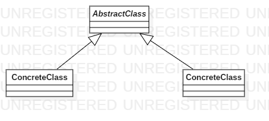

# 模板方法模式

模板方法模式是一种较为常见的行为型设计模式，其理念就是在父类中规定代码框架，而具体的实现在子类中完成

我们假设一个场景：现在你有一辆摩托车，你要骑着它出去。

```java
public class Motocycle {

    public void drive() {
        boarding();
        fire();
        gun();
        go();
    }

    private void go() {
        System.out.println(this.getClass().getSimpleName() + " go");
    }

    private void gun() {
        System.out.println("Twist the handlebar");
    }

    private void fire() {
        System.out.println("Step on the pedal");

    }

    private void boarding() {
        System.out.println("Sitting on the motorcycle");
    }

    public static void main(String[] args) {
        Motocycle motocycle = new Motocycle();
        motocycle.drive();
    }

}
```

场景更改：现在你买了一辆小汽车，你也要开着它出去

```java
public class Car {
    public void drive() {
        boarding();
        fire();
        gun();
        go();
    }

    private void go() {
        System.out.println(this.getClass().getSimpleName() + " go");
    }

    private void gun() {
        System.out.println("Step on the gas pedal");
    }

    private void fire() {
        System.out.println("Screw the key");

    }

    private void boarding() {
        System.out.println("Sitting in the car");
    }

    public static void main(String[] args) {
        Car car = new Car();
        car.drive();
    }
    
}
```

emmm......貌似是可以的，但是好像有一些重复代码是没必要写两遍的

- drive方法
- go方法

开车的过程虽然细节大不相同，但是步骤是一样的，重构后的代码如下

```java
public abstract class AbstractTransportation {
    public final void drive() {
        boarding();
        fire();
        gun();
        go();
    }

    protected abstract void gun();

    protected abstract void fire();

    protected abstract void boarding();

    private void go() {
        System.out.println(this.getClass().getSimpleName() + " go");
    }
}

public class Motocycle extends AbstractTransportation{

    @Override
    protected void gun() {
        System.out.println("Twist the handlebar");
    }

    @Override
    protected void fire() {
        System.out.println("Step on the pedal");

    }

    @Override
    protected void boarding() {
        System.out.println("Sitting on the motorcycle");
    }

    public static void main(String[] args) {
        Motocycle motocycle = new Motocycle();
        motocycle.drive();
    }

}

public class Car extends AbstractTransportation {


    @Override
    protected void gun() {
        System.out.println("Step on the gas pedal");
    }

    @Override
    protected void fire() {
        System.out.println("Screw the key");

    }

    @Override
    protected void boarding() {
        System.out.println("Sitting in the car");
    }

    public static void main(String[] args) {
        Car car = new Car();
        car.drive();
    }
}
```

可以看到，我们将开车的drive方法上移至抽象类，go方法由于是一样的，所以也进行上移。更改后的代码更加的间接明了了
## 总结

模板方法模式类图如下



一个抽象类规定步骤，由子类具体实现

模板方法模式有什么优点呢？最明显的，模板方法模式将不变的行为移到父类，减少了代码。其次，由子类来实现算法的某些细节，有助于业务的扩展

## 实际使用场景

在很多优秀的程序中都可以见到模板方法模式，接下来就举一个在jdk源码中的实例加以讲解

```java
//AbstractQueuedSynchronizer#acquire
//tryAcquire方法交由子类实现
public final void acquire(int arg) {
    if (!tryAcquire(arg) &&
        acquireQueued(addWaiter(Node.EXCLUSIVE), arg))
        selfInterrupt();
}

protected boolean tryAcquire(int arg) {
    throw new UnsupportedOperationException();
}
```

 如上文代码，在抽象类中规定要请求就必须先执行tryAcquire方法，并在tryAcquire中抛出异常，所以子类必须实现tryAcquire方法，否则就无法使用acquire方法。

