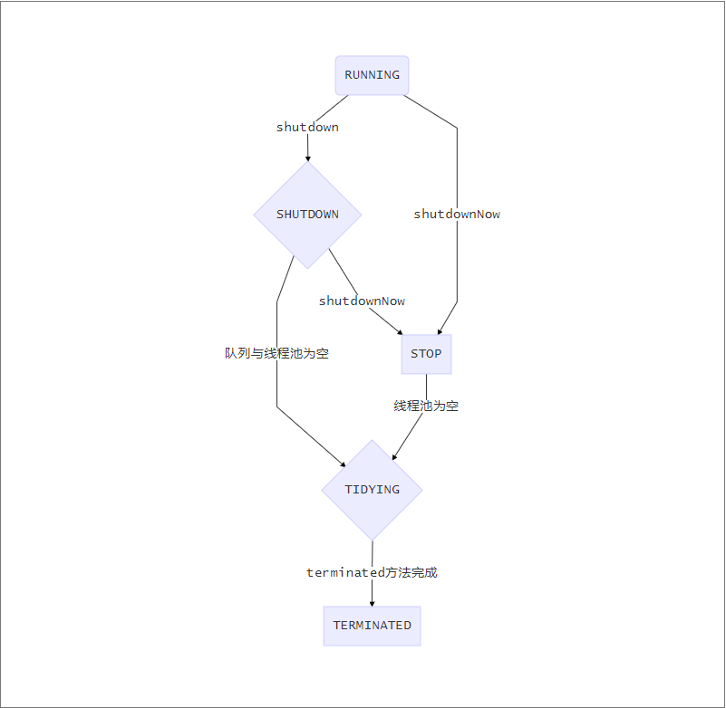

# 线程池的使用

[[toc]]

在Java中，提到多线程，就一定绕不开线程池。

## 创建线程池

在Java中新建一个类一般而言是使用new关键字来调用其构造方法，线程池也不例外，之所以将其单独拿出来说一说，是因为线程池的构造器中的参数都是比较不容易理解的

```java
public ThreadPoolExecutor(
    //核心线程数
    int corePoolSize,
    //最大线程数
    int maximumPoolSize,
    //任务完成后的超时时间
    long keepAliveTime,
    //超时时间单位
    TimeUnit unit,
    //阻塞队列
    BlockingQueue<Runnable> workQueue,
    //线程工厂
    ThreadFactory threadFactory,
    //拒绝策略
    RejectedExecutionHandler handler
    )
```

在上述代码中，前5个参数是必须指定的，后两个则不需要，如果不指定线程工厂和拒绝策略，则会使用**默认的线程工厂和抛弃策略

### 参数设置

那么我们在创建线程池时，应该如何来指定线程池的参数呢？

#### 线程数

首先我们要判断我们线程池将要执行的任务是CPU密集型的还是IO密集型的，如果是CPU密集型的，那么我们的线程数最好是CPU数量+1；如果是IO密集型的，则线程池完全可以开的大一点，比如2*CPU数量。

#### 阻塞队列

- 有界队列ArrayBlockingQueue

- 无界队列LinkedBlockingQueue

- 优先级队列PriorityBlockingQueue

- 延时队列DelayQueue

- 同步交付队列SynchronousQueue

#### 拒绝策略

- 舍弃策略AbortPolicy

  抛出RejectedExecutionException异常

- 抛弃策略DiscardPolicy

  直接将该任务抛弃，什么也不做

- 抛弃最早策略DiscardOldestPolicy

  从阻塞队列中取出一个并尝试重新执行

- 调用者运行策略CallerRunsPolicy

  调用该线程池的线程执行

### 其他配置

- 在默认的情况下，线程池中的核心工作者是不会结束的，如果我们想要让核心工作者和非核心工作者一样没有任务就结束的话，可以使用ThreadPoolExecutor#allowCoreThreadTimeOut方法来将其设置为true。

- 线程的创建是需要一定时间开销的，如果我们希望在任务来临之前就省去这些开销，则可以使用以下两个方法

  - ThreadPoolExecutor#prestartCoreThread

    提前启动一个核心工作者

  - ThreadPoolExecutor#prestartAllCoreThreads

    提前启动所以核心工作者

::: tip

线程池的创建还可以通过Executors类来创建，但是由于其配置参数一般不满足配置需求，而且使用工具类不易于我们了解线程池的工作原理，所以不推荐这种方法来创建线程池

:::

## 停止线程池

线程池提供了两个关于停止的方法以及一系列的查看线程池状态的方法

### 停止方法

- ThreadPoolExecutor#shutdown

  设置线程池状态为shutdown，调用所有工作者线程的Interrupt方法

- ThreadPoolExecutor#shutdownNow

  设置线程池状态为stop，调用所有工作者线程的Interrupt方法，清空阻塞队列并返回

### 查看线程池状态方法

在学习查看线程池状态方法之前，我们先来了解一下线程池的状态流转



- isShutdown

  判断线程池是否是RUNNING状态

- isTerminating

  判断线程池是否是SHUTDOWN\STOP\TIDYING状态

- isTerminated

  判断线程池是否是TERMINATED状态

- awaitTermination

  循环等待一段时间直到线程池状态为TERMINATED